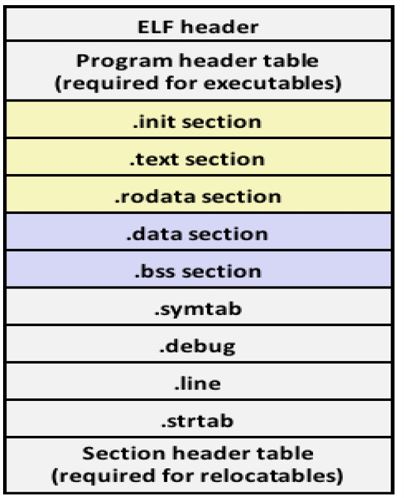
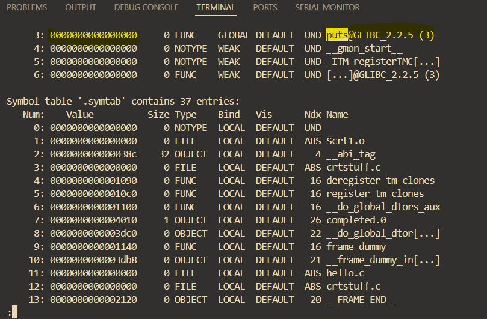
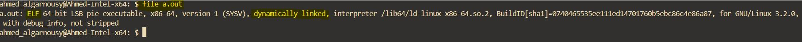
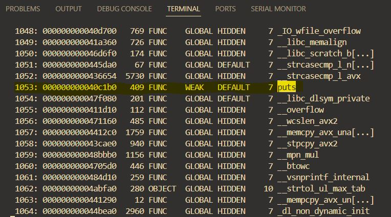
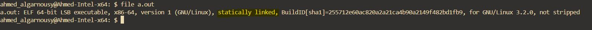
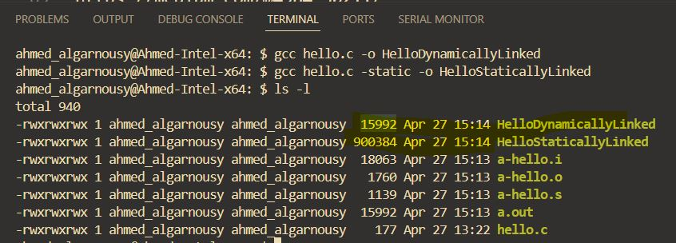

### ELF Format

ELF (Executable and Linkable Format) is a standard binary file format used for executables, object code, shared libraries, and core dumps on Unix-like operating systems (Linux, FreeBSD, etc.).

It defines how data and instructions are organized inside the binary so that the operating system loader and linker know where to find code, symbols, and metadata.

ELF files can represent several types of files:

- Executable files (ET_EXEC): Ready-to-run programs.
- Relocatable object files (ET_REL): Intermediate files used during compilation (e.g., .o files).
- Shared libraries (ET_DYN): Dynamically linked libraries (e.g., .so files).
- Core dumps (ET_CORE): Memory snapshots used for debugging.

l

> **Note:** number and type of sections differ according to file (object, shared library, executable, coredump)

<p align="center">
  
</p>

```bash
$ readelf -a fileName
```

```bash
$ readelf -s a.out | less
```

- printf functions evaluates to puts functions

<p align="center">
  
  
</p>

- `UND` stands for undefined
- as this's a final executable but it's not resolved this puts function address

- To resolve its address link c library statically

```bash
$ gcc hello.c -static
$ readelf -s a.out | less
```

<p align="center">
  
  
</p>

> **Note:** in embedded systems baremetal or RTOS we only compile(link) statically

### dynamic linking

UNIX-like Operating systems use dynamic linking by default, as we have many programs that needs printf so it's waste of memory to load it at compile time in each program
, instead we put it in a shared library and loader program in OS resovle the addresses in runtime

> **Note**: the size of elf file that statically linked is larger than elf file that is dynamically linked.

<p align="center">
  
</p>

```bash
$ objdump -D a.out | less # disassembly the machine code
```

```bash
$ hexdump
$ nm
$ objdump
```

#### Additional Resources

https://medium.com/@4984_30211/elf-format-toolbox-ee110fe987ba
