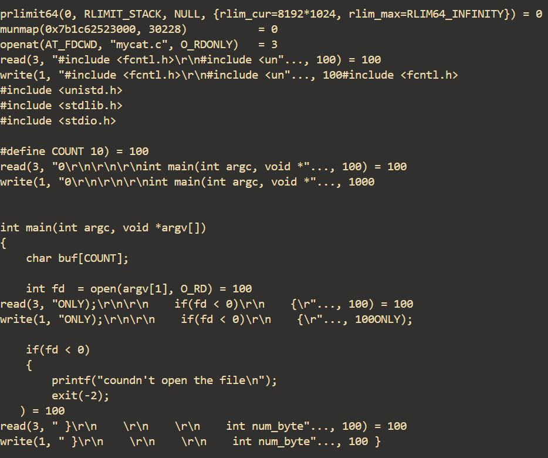
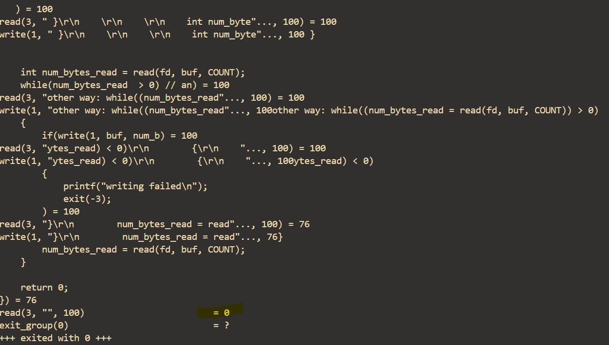

<p align="center">
  
</p>

##### removing ./ from my-own-programs

<p align="center">
  
  
</p>

```bash
$ sudo cp argELF /usr/bin/
```

#### strace mycat program

```bash
$ strace ./mycat mycat.c
```

<p align="center">
  
  
</p>

- Note: fd of mycat.c is 3 after fd number 2 for the open stderr
- also note program exits after read system call return 0 (END-OF-FILE)
