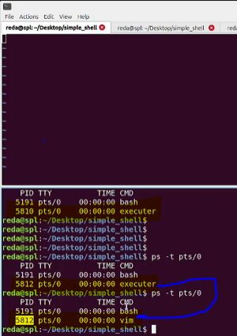

### to the definition of exec system call that is replace the old program with the new program, only

- runs the ./executer /usr/bin/vim in terminal
- open another terminal and run ps -t pts/o to see the processes

then enter a character in ./executer /usr/bin/vim to see the vim now running instead of executer with the same PID

  

