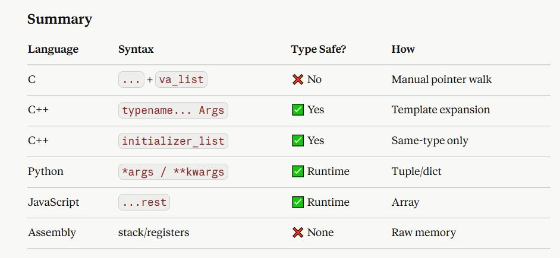

#### The Problem It Solves

Normal functions have a fixed signature:

```c
int add(int a, int b);        // always exactly 2 args
```

#### But what if you need:

```c
printf("hello");                      // 1 arg
printf("x = %d", x);                 // 2 args
printf("%d + %d = %d", a, b, a+b);   // 4 args
```

- **You can't write a separate function for each case → use ...**

##### C — How It Works (<stdarg.h>)

```c
#include <stdio.h>
#include <stdarg.h>

// Sum any number of integers; count tells how many
int sum(int count, ...) {
    va_list args;           // a cursor into the argument list
    va_start(args, count);  // initialize: start AFTER last named param

    int total = 0;
    for (int i = 0; i < count; i++) {
        total += va_arg(args, int);  // read next arg as int, advance cursor
    }

    va_end(args);           // clean up
    return total;
}

int main() {
    printf("%d\n", sum(3, 10, 20, 30));  // 60
    printf("%d\n", sum(2, 5, 7));        // 12
}
```

<p align="center">
  
</p>
