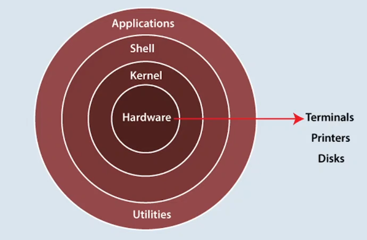
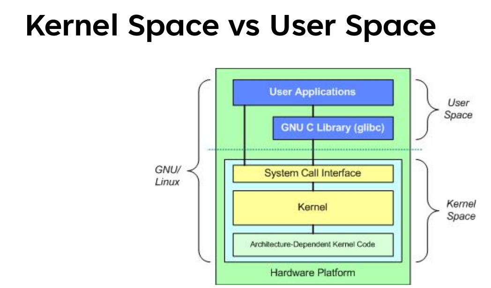
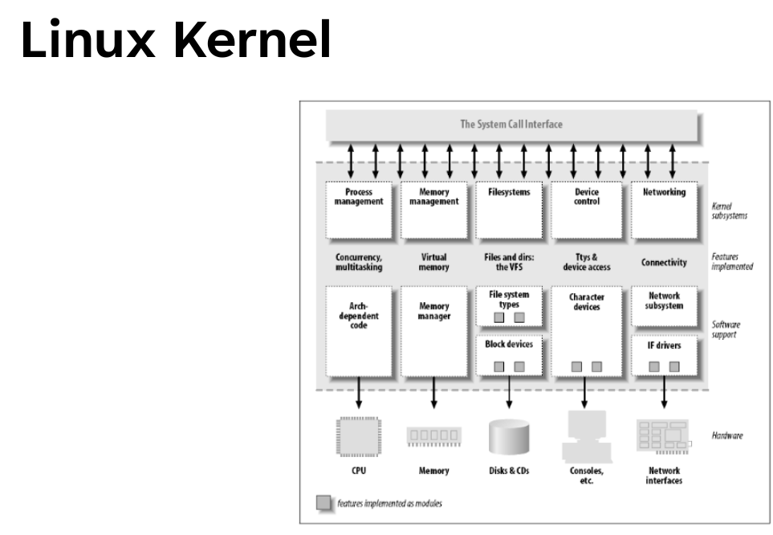

## System Programming In Linux

[repo-code-exercises](https://github.com/RedaMaher/spl01_code_exercises.git)

### Content

`12 hr`

1. Introduction
2. Unix & Linux History
3. Linux OS Architecture
4. Environment Preparation
5. Basic Command Line Usage
6. Building the first C program in linux
7. Process overview
8. Implementing your first Unix utility
9. Implementing a simple shell
10. Finally

### what and Why

#### what will we learn ?

we have computer systems in everywhere
and most of these devices can't work without a piece od software called `OS`.

may be baremetal , RTOS

- what is an OS?
  - process management
  - Device management
  - Filesystem management
  - etc..

system programming vs application programming

**system programming**: Develops software that interacts closely with hardware or provides services to other software (like operating systems, device drivers,
program that handle fragmentation issue on hard disk, dynamic memory management, etc.)

**application programming**: Develops software that performs specific tasks for end users (like word, browsers, games)

#### why do we need to learn this topic ?

- linux is used in everywhere
- Deepen understanding of the computer systems

---

### LInux History

#### Multics

they have to rewrite logic again for PDP-11 machine (different hardware and machine code, portability issue)

and at this time they decided to invented C language from B langauge to make an OS portable on different machine

from efforts of UC Berkely added BSD(based on UNIX) is tcp/ip stack

#### Unix standarizayion efforts

[UNIX History](https://levenez.com/unix/)

system V (V for five)

linux torvalds starts from MINIX OS build by his teacher for educational purpose and was not efficient

##### Linux nowsdays

at 2008 android starts to build it based on linux

###### Assignment 1: `Read the first chapter in the Linux Programming Interface (LPI) reference book.`

### Practice Test Questions

- SUS stand for Single UNIX Specification
- reason behind the UNIX standardization is UNIX Implementations diverged and application portability became hard

- What was the major disadvantage in the Minix implementation as an efficient OS?
  it was designed to be largely independent of the hardware architecture.

binary portability is Source Code Compatibility is achieved by compiling a program once for a given HW and running it on any conformant OS running on that HW

- POSIX and SUS ensure: Source Code Compatibility.

- POSIX and SUS are Different standards for the OS Interface.

---

### Linux OS Architecture

`

- Arch Dependent kernal code == device drivers

---

### Env Setup

#### what is the virtualization?

hardware should be support virtualization and also install hypervisor(VMWare, Virtual Box, etc)

**Cloud virtualization** is the application of virtualization technology within a cloud computing environment. It allows multiple operating systems and applications to run on a single physical server, optimizing resource utilization and enabling on-demand access to IT resources over the internet. This contrasts with traditional computing, where each application or operating system typically requires its own dedicated physical server

##### virtualization vs emulation

virtualization is about sharing resources or dividing it for the same hardware
that means all guests os runs for specific hardware architecture for ex intel or arm or x86

but emulation emulates new hardware architecture on another hardware architecture

virtualization uses a hypervisor to create virtual machines that share the host's hardware resources, while emulation involves translating instructions from one instruction set architecture to another.

### Resources

[Course Link](https://www.udemy.com/course/spl01-system-programming-in-linux/)
