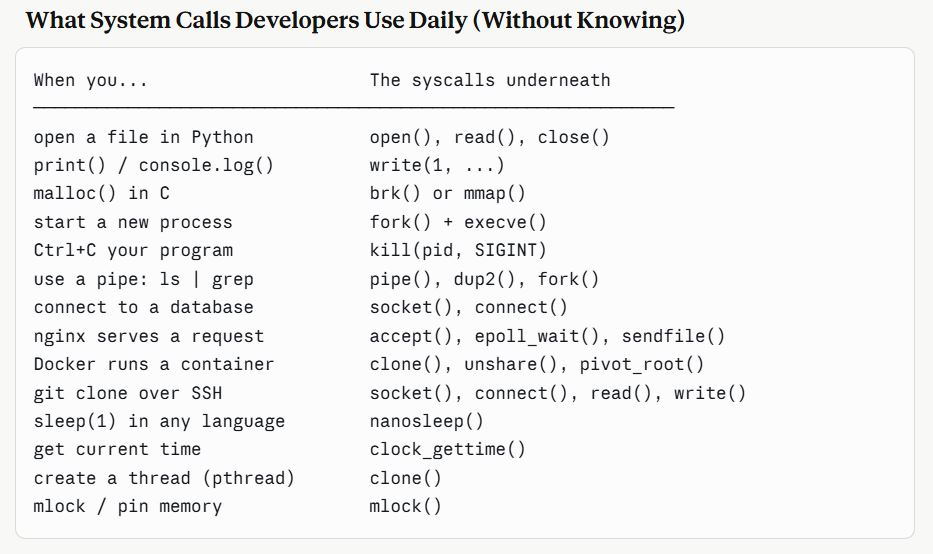

#### Roadmap

Phase 1: Foundation  
──────────────────
C language mastery
Pointers & memory
Compilation process
Computer architecture I
Linux basics

Phase 2: Core Syscalls
──────────────────

File I/O deeply
Process control
Signals Memory
IPC mechanisms
/proc filesystem

Phase 3: Advanced
──────────────────
Networking (sockets)
Multithreading
Memory mapping
Performance tuning
Writing your own shell

uses

<p align="center">
  
</p>

#### Essential Linux Command-Line Tools

```bash
strace ./program          # trace all syscalls a program makes
ltrace ./program          # trace library calls
ldd ./program             # show shared library dependencies
readelf -h ./program      # inspect ELF binary headers
objdump -d ./program      # disassemble binary
nm ./program              # list symbols
/proc/<pid>/maps          # view process memory map live
/proc/<pid>/fd/           # view open file descriptors live
man 2 read                # man section 2 = syscall manual pages

```

### Phase 2 — The Core System Calls (In Depth)

#### Category 1: File I/O — The Most Used

```c
#include <fcntl.h>
#include <unistd.h>

// ── open() ──────────────────────────────────────────────────
int fd = open(path, flags, mode);
//  path:  file path
//  flags: O_RDONLY, O_WRONLY, O_RDWR
//         O_CREAT  - create if not exists
//         O_TRUNC  - truncate to 0 on open
//         O_APPEND - always write at end
//         O_NONBLOCK - don't block on open
//  mode:  permissions if creating (e.g. 0644)
//  returns: fd (>= 0) or -1 on error

int fd = open("data.txt", O_RDWR | O_CREAT | O_TRUNC, 0644);

// ── read() ──────────────────────────────────────────────────
ssize_t n = read(fd, buf, count);
//  NEVER assume it reads exactly count bytes!
//  Loop until you get what you need:

char buf[4096];
ssize_t total = 0;
while (total < needed) {
    ssize_t n = read(fd, buf + total, needed - total);
    if (n == 0) break;           // EOF
    if (n == -1) {
        if (errno == EINTR) continue;  // interrupted by signal, retry
        perror("read"); break;
    }
    total += n;
}

// ── write() ─────────────────────────────────────────────────
ssize_t n = write(fd, buf, count);
// Same — loop! write() can do partial writes

// ── lseek() ─────────────────────────────────────────────────
off_t pos = lseek(fd, offset, whence);
//  SEEK_SET  - from beginning
//  SEEK_CUR  - from current position
//  SEEK_END  - from end of file

off_t size = lseek(fd, 0, SEEK_END);   // get file size
lseek(fd, 0, SEEK_SET);                // rewind to start

// ── stat() ──────────────────────────────────────────────────
struct stat st;
stat("file.txt", &st);
printf("size:  %ld\n", st.st_size);
printf("inode: %ld\n", st.st_ino);
printf("perms: %o\n",  st.st_mode & 0777);
printf("mtime: %ld\n", st.st_mtime);

// ── dup2() — redirect file descriptors ──────────────────────
// This is how shells implement redirection: ./prog > output.txt
int outfile = open("output.txt", O_WRONLY | O_CREAT | O_TRUNC, 0644);
dup2(outfile, STDOUT_FILENO);   // stdout now points to outfile
close(outfile);
// Now printf() writes to output.txt

// ── fcntl() — control fd properties ─────────────────────────
int flags = fcntl(fd, F_GETFL);          // get flags
fcntl(fd, F_SETFL, flags | O_NONBLOCK); // set non-blocking
fcntl(fd, F_SETFD, FD_CLOEXEC);         // close on exec
```

#### Category 2: Process Control

```c
#include <unistd.h>
#include <sys/wait.h>

// ── fork() ──────────────────────────────────────────────────
pid_t pid = fork();
// Returns TWICE:
//   In parent: pid = child's PID
//   In child:  pid = 0
//   On error:  pid = -1

if (pid == -1) {
    perror("fork");
} else if (pid == 0) {
    // ── CHILD process ──
    printf("I am child, PID = %d\n", getpid());
    exit(0);
} else {
    // ── PARENT process ──
    printf("I spawned child PID = %d\n", pid);
}

// ── exec family ─────────────────────────────────────────────
// Replaces current process image with a new program
// fork + exec = how every shell command runs

execl("/bin/ls", "ls", "-la", NULL);
execv("/bin/ls", argv);
execvp("ls", argv);        // searches PATH automatically
execve("/bin/ls", argv, envp); // full control

// ── wait() / waitpid() ──────────────────────────────────────
int status;
pid_t child = waitpid(pid, &status, 0);
//  options: 0         = block until child exits
//           WNOHANG   = don't block (return 0 if child still running)
//           WUNTRACED = also report stopped children

if (WIFEXITED(status))
    printf("exited with code %d\n", WEXITSTATUS(status));
if (WIFSIGNALED(status))
    printf("killed by signal %d\n", WTERMSIG(status));

// ── Building a mini shell ────────────────────────────────────
while (1) {
    char *line = readline("$ ");
    char **args = parse(line);

    pid_t pid = fork();
    if (pid == 0) {
        execvp(args[0], args);   // child becomes the command
        perror("exec");
        exit(127);
    }
    waitpid(pid, &status, 0);    // parent waits
}
```

---

#### The Golden Rules of System Programming

1. ALWAYS check return values
   → Every syscall can fail. Never assume success.

2. ALWAYS handle partial read/write
   → read() and write() may transfer less than you asked.

3. ALWAYS handle EINTR
   → Syscalls interrupted by signals return -1 with errno=EINTR.
   → Either retry or use SA_RESTART flag.

4. ALWAYS close file descriptors
   → FD leaks crash long-running servers.

5. NEVER ignore SIGPIPE
   → Writing to a closed socket kills your process silently.

6. Use strace first, ask questions later
   → When something breaks, strace reveals EXACTLY what's happening.

7. Read the man page for every function you use
   → Especially the ERRORS section — that's where edge cases live.

---

### Resources

Books (in order):

1. "The Linux Programming Interface" — Michael Kerrisk ← THE bible
2. "Advanced Programming in UNIX Environment" — Stevens
3. "Computer Systems: A Programmer's Perspective" — Bryant
4. "Linux Kernel Development" — Robert Love

Man pages (always available):
man 2 <syscall> → syscall documentation
man 3 <function> → C library function docs
man 7 <topic> → overview pages (man 7 signal, man 7 socket)

Online:
linux.die.net
man7.org
elixir.bootlin.com ← Linux kernel source, browsable
