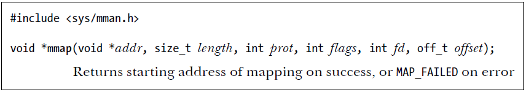
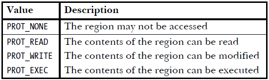
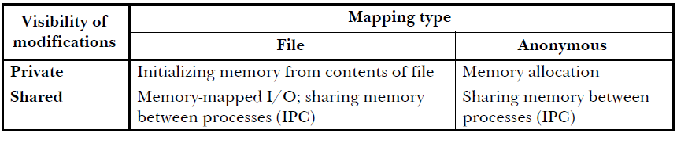
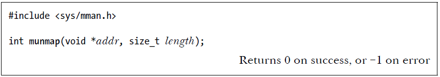
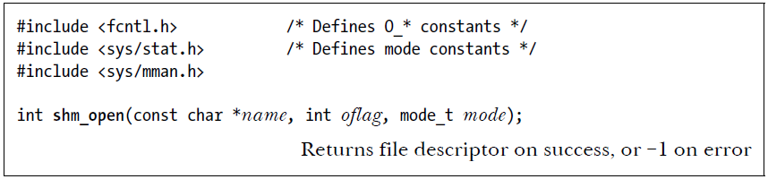
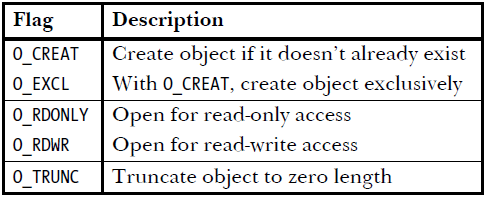
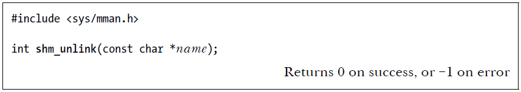

# Memory Mapping and Shared Memory in Linux

## Memory Mapping

### Overview
The `mmap()` system call creates a new memory mapping in the calling process’s virtual address space. It allows for efficient file access and memory allocation, avoiding the need for traditional heap expansion.

### Types of Memory Mapping
#### 1. File Mapping
- Maps an existing file into memory for faster access.
- The file contents are automatically loaded as needed (demand paging).
- Also known as a **memory-mapped file**.

#### 2. Anonymous Mapping
- Does not correspond to a file; the pages are initialized to zero.
- Used for dynamic memory allocation (e.g., process stack and heap expansion).
- Functions as a zero-paged virtual file.
- used between parent and childern.

### Difference Between `brk()` and `mmap()`
- `mmap()` does not modify the heap (`sbrk` pointer); instead, it reserves memory pages in the page table.
- `malloc()` internally uses `mmap()` for large allocations beyond a threshold.
- `mmap()` provides faster memory reservation and avoids heap fragmentation.

## Private vs. Shared Mapping

### 1. Private Mapping (`MAP_PRIVATE`)
- Modifications are **not** visible to other processes.
- Copy-on-Write (COW) is used when a process modifies a page.
- not reallacote again in HD.

### 2. Shared Mapping (`MAP_SHARED`)
- Modifications are **visible** to other processes sharing the same mapping.
- Changes are written back to the underlying file.
- Requires synchronization mechanisms to prevent conflicts.

## Memory Sharing Between Processes

Memory mappings can be shared in two ways:
1. **Shared File Mapping**: Two or more processes map the same file region, sharing physical memory pages.
2. **Copy-on-Write (COW) with `fork()`**: A child process inherits its parent’s memory mappings. Pages are **shared** until one process modifies them, triggering COW behavior.

## Types of Memory Mappings
1. **Private File Mapping**: Used for initializing memory regions from a file (e.g., loading executables or shared libraries).
2. **Private Anonymous Mapping**: Used for process-private memory allocation (e.g., `malloc()` for large allocations).
3. **Shared File Mapping**: Used for memory-mapped I/O and inter-process communication (IPC).
4. **Shared Anonymous Mapping**: Used for IPC between related processes without COW behavior.

## Creating and Managing Mappings

### `mmap()` System Call

- Used to create a new memory mapping.
- Can specify whether mapping is **private** or **shared**.
- If mapping size exceeds the file size, extra pages are filled with zeros.
- The `addr` argument indicates the virtual address at which the mapping is to be located if applicable. If we specify addr as NULL, the kernel chooses a suitable address for the mapping. This is the preferred way of creating a mapping.
- The `length` argument specifies the size of the mapping in bytes. Although length doesn’t need to be a multiple of the system page size (as returned by sysconf(_SC_PAGESIZE)), the kernel creates mappings in units of this size, so that length is, in effect, rounded up to the next multiple of the page size.
- The `prot` argument is a bit mask specifying the protection to be placed on the mapping. illustrated next.

- The `flags` argument is a bit mask of options controlling various aspects of the mapping operation including whether this mapping will be Private `(MAP_PRIVATE)` or Shared `(MAP_SHARED)`.

- The offset argument specifies the starting point of the mapping in the file and must be a multiple of the system page size.

### Synchronization and Memory Protection
- `msync()` ensures modifications in a shared mapping are written to disk.
- `mprotect()` modifies memory protection settings.
- `munmap()` removes a memory mapping from a process’s address space.

## Shared Memory in Linux

### POSIX Shared Memory (`shm_open()`)
- Allows unrelated processes to share memory via a dedicated `/dev/shm` filesystem.
- Requires `shm_open()` to create or open shared memory objects.
- Uses `mmap()` to map shared memory into a process’s address space.
- will be lost if the system is shut down.
- The arguments to shm_open() are analogous to those for open().

- When a new shared memory object is created, it initially has zero length. This means that, after creating a new shared memory object, we normally call `ftruncate()` to set the size of the object before calling `mmap()`.

- The permissions and ownership of a shared memory object can be changed using `fchmod()` and `fchown()`, respectively.

### Managing Shared Memory Objects
- `ftruncate()` sets the size of a shared memory object.
- `fstat()` retrieves shared memory information.
- `shm_unlink()` removes a shared memory object, preventing further access but keeping existing mappings until unmapped.

